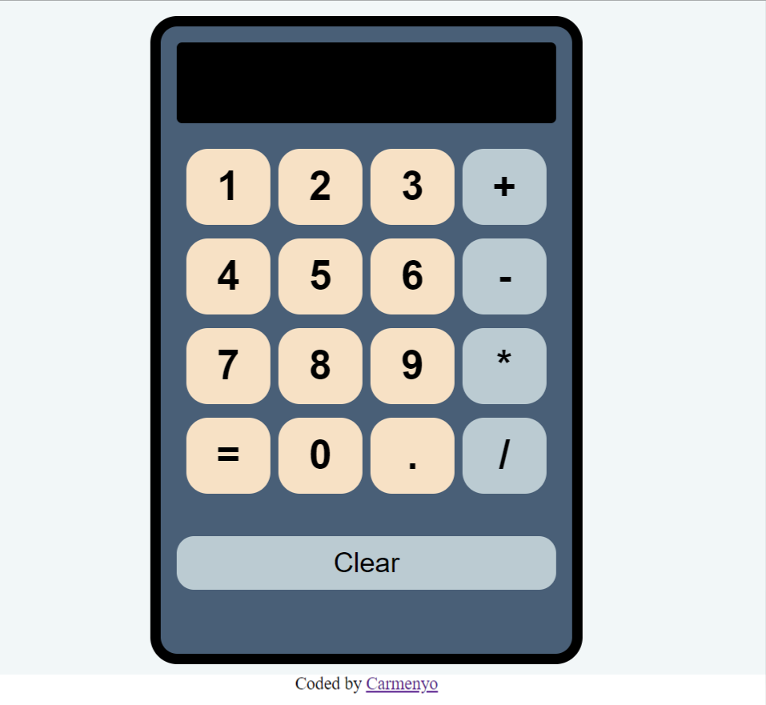

# React Calculator

A simple calculator built using React, HTML, and CSS. This calculator allows performing basic arithmetic operations such as addition, subtraction, multiplication, and division.

## Features

- Perform basic arithmetic operations.
- Intuitive and user-friendly interface.
- Responsive design compatible with both mobile and desktop devices.

## Technologies Used 🛠️

-   React: JavaScript library for building user interfaces.
- <a href="https://www.w3.org/html/" target="_blank" rel="noreferrer">  HTML: Markup language for structuring the web page.
-  CSS: Styling language for design and presentation.

## Usage Instructions

1. Clone this repository using the command: `git clone https://github.com/carmenyo/calculator-react.git`
2. Navigate to the project directory: `cd calculator-react`
3. Install the dependencies: `npm install`
4. Start the application: `npm start`
5. Open your web browser and go to `http://localhost:3000` to use the calculator.

## Customization

If you wish to customize or extend the calculator, here are some areas you can explore:

- Adding additional mathematical operations.
- Enhancing the design and user experience.
- Implementing keyboard shortcuts.
- Adding a calculation history feature.

## Contributions

Contributions are welcome! If you find bugs, have ideas for improvements, or want to contribute in any way, feel free to do so through pull requests.

## Autora ✒️

- **Carmen Castro** - [Carmenyo](https://github.com/Carmenyo)
